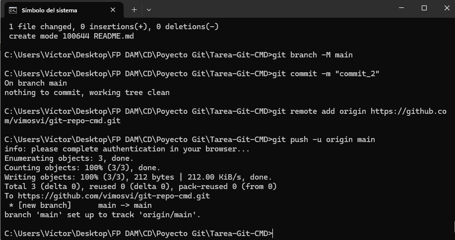

# Comandos empleados

git init

git add README.md

git commit -m "commit_1"

git branch -M main

git remote add origin https://github.com/vimosvi/git-repo-cmd.git

git push -u origin main

git add images

# Nueva imagen

